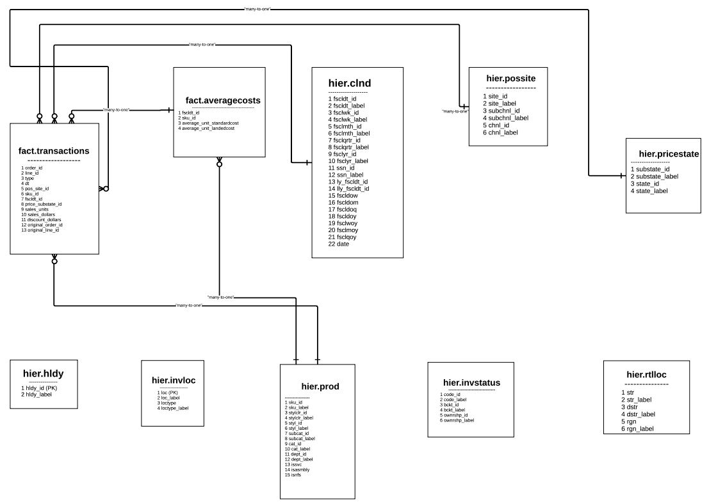

Hello Welcome to the Gsynergy data Pipeline project

To run this Gsynergy.py file user need to enter all credentials with respect to their names.

-------------------------------------------------------------------------------------------------------------------------
ER(Entity Relationship Diagram)

* fact.transactions has a many-to-one relationship with fact.averagecosts on fscldt_id and sku_id.

* fact.transactions has a many-to-one relationship with hier.clnd on fscldt_id.

* fact.transactions has a many-to-one relationship with hier.possite on pos_site_id.

* fact.transactions has a many-to-one relationship with hier.prod on sku_id.

* fact.transactions has a many-to-one relationship with hier.pricestate on price_substate_id.

* fact.averagecosts has a many-to-one relationship with hier.prod on sku_id.

-------------------------------------------------------------------------------------------------------------------------------------
project functionality

1) The project file gsynergy.py loads the raw data from an AWS S3 bucket using Python and generates a response.

2) The read_gzipped_file_from_s3 function extracts data from each .gz file in S3 and loads it into a dataframe.

3) The check_non_unique_primary_key function assigns the leftmost column as the primary key column and identifies duplicate rows.

4) The perform_basic_checks function checks for null values in the dataframe. If any are found, it fills them with 0 using the fill_null_with_zero function.

5) The convert_data_types function checks the data types of all columns using the get_column_datatypes function and converts them as per the required data types.

6) The aggregate_sales function based on ER performs aggregations on transactional columns.

7) The save_to_s3 function loads the aggregated mview_weekly_sales.csv data file into the S3 bucket.

